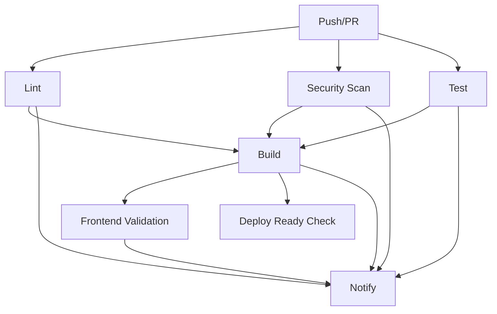

# CI/CD Pipeline Documentation

## Overview

This document describes the Continuous Integration and Continuous Deployment (CI/CD) pipeline implemented for the Spell Checker application using GitHub Actions.

## Pipeline Architecture

### Workflow Triggers

The CI/CD pipeline runs on:
- **Push** to `master`, `main`, or `develop` branches
- **Pull Requests** targeting `master` or `main` branches

### Pipeline Jobs



## Job Descriptions

### 1. Lint Job

**Purpose**: Code quality and style enforcement

**Steps**:
- Checkout code
- Set up Python environment
- Install linting tools (Black, isort, Flake8, Pylint)
- Run code formatters (check mode)
- Run style checkers
- Generate linting reports

**Tools Used**:
- **Black**: Code formatter (PEP 8 compliant)
- **isort**: Import sorting
- **Flake8**: Style guide enforcement
- **Pylint**: Code quality analysis

**Configuration**:
```yaml
python-version: 3.11
max-line-length: 127
max-complexity: 10
```

### 2. Security Scan Job

**Purpose**: Vulnerability detection and security analysis

**Steps**:
- Checkout code
- Set up Python environment
- Install security tools (Safety, Bandit)
- Check dependencies for vulnerabilities
- Scan code for security issues
- Upload security reports

**Tools Used**:
- **Safety**: Dependency vulnerability scanner
- **Bandit**: Security issue detector

**Artifacts**:
- `bandit-security-report.json`: Detailed security findings

### 3. Test Job

**Purpose**: Automated testing across multiple Python versions

**Strategy**:
- Matrix testing: Python 3.9, 3.10, 3.11
- Parallel execution across versions

**Steps**:
- Checkout code
- Set up Python (matrix version)
- Install dependencies
- Run pytest with coverage
- Upload coverage reports to Codecov
- Generate HTML coverage reports

**Configuration**:
```yaml
pytest-options:
  - verbose
  - coverage
  - parallel execution (pytest-xdist)
coverage-targets:
  - lib/
  - main.py
```

**Artifacts**:
- `test-results-{python-version}`: Test results and coverage
- Coverage reports (XML, HTML, terminal)

### 4. Build Job

**Purpose**: Validate application structure and build readiness

**Dependencies**: Requires lint, security, and test jobs to pass

**Steps**:
- Checkout code
- Set up Python environment
- Install dependencies
- Validate module imports
- Check required files exist
- Lint JavaScript files
- Build documentation

**Validation Checks**:
```bash
✓ main.py exists
✓ requirements.txt exists
✓ lib/ directory exists
✓ docs/ directory exists
✓ All modules import successfully
✓ JavaScript syntax valid
```

### 5. Frontend Validation Job

**Purpose**: Validate frontend assets and code

**Steps**:
- Checkout code
- Set up Node.js environment
- Validate HTML structure
- Check JavaScript syntax
- Validate CSS files

**Tools Used**:
- **html-validate**: HTML validation
- **Node.js**: JavaScript syntax checking

### 6. Deploy Ready Job

**Purpose**: Verify deployment readiness for production branches

**Trigger**: Only runs on `master` or `main` branches

**Steps**:
- Checkout code
- Verify deployment configuration files
- Generate deployment report
- Upload deployment artifacts

**Checks**:
```bash
✓ Procfile exists
✓ runtime.txt exists
✓ Deployment configuration valid
```

**Artifacts**:
- `deployment-report.md`: Comprehensive deployment information

### 7. Notify Job

**Purpose**: Aggregate and report pipeline results

**Dependencies**: Runs after all other jobs (even on failure)

**Output**: Summary of all job results

## Configuration Files

### Workflow File Location

```
.github/workflows/ci-cd.yml
```

### Environment Variables

```yaml
PYTHON_VERSION: '3.11'    # Default Python version
NODE_VERSION: '18'        # Node.js version for frontend
```

### Secrets Required

None required for basic pipeline. Optional secrets:

- `CODECOV_TOKEN`: For Codecov integration
- `SENTRY_AUTH_TOKEN`: For Sentry integration
- `DEPLOY_KEY`: For automated deployment

## Usage Guide

### Running Pipeline Locally

#### Lint Checks
```bash
# Install dependencies
pip install black isort flake8 pylint

# Run formatters (check mode)
black --check --diff .
isort --check-only --diff .

# Run linters
flake8 . --max-line-length=127
pylint lib/ main.py --max-line-length=127
```

#### Security Checks
```bash
# Install security tools
pip install safety bandit

# Check dependencies
safety check

# Scan code
bandit -r lib/ main.py
```

#### Run Tests
```bash
# Install test dependencies
pip install pytest pytest-cov pytest-xdist

# Run tests with coverage
pytest tests/ -v --cov=lib --cov=main --cov-report=term-missing
```

### Viewing Pipeline Results

#### GitHub Actions UI
1. Navigate to repository
2. Click "Actions" tab
3. Select workflow run
4. View job details and logs

#### Status Badges

Add to README.md:
```markdown

```

### Artifacts

Pipeline generates several artifacts:

1. **Security Reports**
   - Path: `bandit-security-report.json`
   - Contains: Security vulnerabilities and recommendations

2. **Test Results**
   - Path: `test-results-{python-version}/`
   - Contains: Coverage reports and test outputs

3. **Deployment Report**
   - Path: `deployment-report.md`
   - Contains: Build information and deployment status

**Accessing Artifacts**:
1. Go to workflow run
2. Scroll to "Artifacts" section
3. Download desired artifact

## Best Practices

### Code Quality

1. **Run linters before committing**
   ```bash
   black .
   isort .
   flake8 .
   ```

2. **Write tests for new features**
   - Minimum 80% code coverage
   - Test edge cases
   - Include integration tests

3. **Keep dependencies updated**
   - Regular `pip install --upgrade`
   - Review Dependabot alerts
   - Test after updates

### Security

1. **Never commit secrets**
   - Use GitHub Secrets for sensitive data
   - Add to `.gitignore`
   - Use environment variables

2. **Review security reports**
   - Check Bandit findings
   - Address Safety vulnerabilities
   - Update vulnerable packages

3. **Audit dependencies**
   - Regularly review `requirements.txt`
   - Remove unused packages
   - Pin versions for stability

### Testing

1. **Comprehensive test coverage**
   - Unit tests for functions
   - Integration tests for workflows
   - E2E tests for critical paths

2. **Fast test execution**
   - Use pytest-xdist for parallel execution
   - Mock external services
   - Optimize slow tests

3. **Reliable tests**
   - No flaky tests
   - Deterministic results
   - Proper setup/teardown

## Troubleshooting

### Common Issues

#### 1. Linting Failures

**Problem**: Black or isort formatting issues

**Solution**:
```bash
# Auto-fix formatting
black .
isort .
git add .
git commit -m "Fix formatting"
```

#### 2. Test Failures

**Problem**: Tests fail in CI but pass locally

**Solution**:
- Check Python version match
- Verify all dependencies installed
- Review test logs carefully
- Check for environment-specific issues

#### 3. Security Scan Issues

**Problem**: Bandit or Safety report vulnerabilities

**Solution**:
```bash
# Update vulnerable package
pip install --upgrade [package-name]

# Or suppress false positive in pyproject.toml
[tool.bandit]
exclude_dirs = ["/tests"]
skips = ["B101"]
```

#### 4. Build Failures

**Problem**: Module import errors

**Solution**:
- Verify all files committed
- Check `__init__.py` files exist
- Review import statements
- Test locally: `python -c "import lib.checker"`

### Debug Mode

Enable debug logging in workflow:

```yaml
- name: Debug Information
  run: |
    echo "Python version: $(python --version)"
    echo "Pip version: $(pip --version)"
    pip list
    pwd
    ls -la
```

## Pipeline Optimization

### Speed Improvements

1. **Use Caching**
   ```yaml
   - uses: actions/setup-python@v5
     with:
       python-version: '3.11'
       cache: 'pip'  # Cache pip dependencies
   ```

2. **Parallel Jobs**
   - Lint, Security, and Test jobs run in parallel
   - Matrix strategy for multiple Python versions

3. **Conditional Execution**
   - Deploy Ready only on main branches
   - Skip unnecessary steps with `if` conditions

### Cost Optimization

1. **Limit Workflow Runs**
   - Use path filters for specific file changes
   - Skip CI on documentation-only changes

2. **Efficient Resource Usage**
   - Use `ubuntu-latest` (faster than Windows/Mac)
   - Cancel redundant runs
   - Set appropriate timeouts

## Integration with Other Services

### Codecov Integration

Add to workflow:
```yaml
- name: Upload coverage to Codecov
  uses: codecov/codecov-action@v4
  with:
    file: ./coverage.xml
    flags: unittests
    name: codecov-umbrella
```

### Slack Notifications

Add to workflow:
```yaml
- name: Slack Notification
  uses: 8398a7/action-slack@v3
  with:
    status: ${{ job.status }}
    webhook_url: ${{ secrets.SLACK_WEBHOOK }}
```

### Deployment Services

#### Heroku
```yaml
- name: Deploy to Heroku
  uses: akhileshns/heroku-deploy@v3.12.12
  with:
    heroku_api_key: ${{ secrets.HEROKU_API_KEY }}
    heroku_app_name: "spell-checker-app"
    heroku_email: "your-email@example.com"
```

#### Railway
```yaml
- name: Deploy to Railway
  run: |
    curl -X POST ${{ secrets.RAILWAY_WEBHOOK_URL }}
```

## Monitoring and Maintenance

### Regular Tasks

1. **Weekly**
   - Review failed workflow runs
   - Update dependencies
   - Check security advisories

2. **Monthly**
   - Review pipeline performance
   - Update GitHub Actions versions
   - Audit artifact retention

3. **Quarterly**
   - Comprehensive security audit
   - Pipeline optimization review
   - Documentation updates

### Metrics to Track

- Pipeline success rate
- Average execution time
- Test coverage trends
- Security vulnerability trends
- Artifact storage usage

## Resources

- [GitHub Actions Documentation](https://docs.github.com/en/actions)
- [pytest Documentation](https://docs.pytest.org/)
- [Black Documentation](https://black.readthedocs.io/)
- [Bandit Documentation](https://bandit.readthedocs.io/)
- [Safety Documentation](https://github.com/pyupio/safety)

---

For questions or issues with the CI/CD pipeline, please open a GitHub issue or contact the DevOps team.
